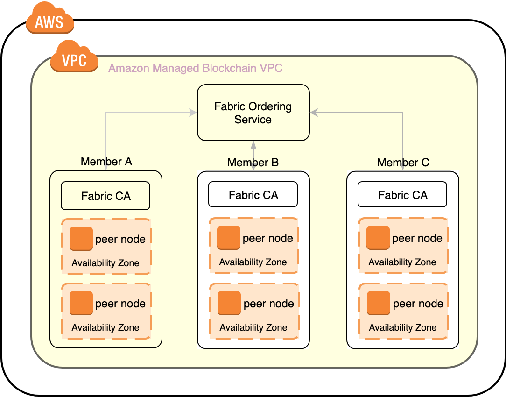

# quickstart-aws-amb-fabric
---
### Amazon Managed Blockchain deployment

This quick start automatically deploys an Amazon Managed Blockchain network in about thirty minutes. It is for IT infrastructure architects, administrators, DevOps professionals, Chaincode developers, or business users who are planning to implement a Hyperledger Fabric node deployment on Amazon Managed Blockchain and deploy a decentralized application (dapp) on the AWS Cloud.

The Quick Start automates deploying an Amazon Managed Blockchain network along with the first blockchain member and its highly-available peer nodes. Review [our backlog](https://github.com/aws-quickstart/quickstart-aws-amb-fabric/issues) for planned improvements or known issues.

The infrastructure deployed by this quick start is shown in the following architectural diagram in the portion highlighted in yellow. The first member (shown as member A) is deployed, and subsequent members must be invited to participate, either using the AWS Management Console or the AWS CLI. The rest of the diagram shows how a well-architected decentralized application (dapp) could be deployed in conjunction with this solution.

    
     
    

    <em>Example architecture of a dapp deployed on Amazon Managed Blockchain</em>

For architectural details and step-by-step instructions, see the deployment guide.

To post feedback, submit feature ideas, or report bugs, use the Issues section of this GitHub repo. If you'd like to submit code for this Quick Start, please review the [AWS Quick Start Contributor's Kit](https://aws-quickstart.github.io/).
